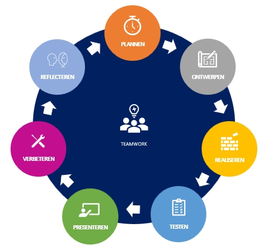

# Challenge - Portfolio

## Wat is een Challenge?

Het is een hele stap om van leren naar toepassen te gaan. Waar het in de modules gaat om het aanleren van kennis en vaardigheden, gaat het er in een Challenge om deze toe te passen in een betekenisvolle situatie. Om een Challenge goed af te ronden moet je dus de stof zoals die in de modules is behandeld beheersen. Daarnaast is een Challenge de manier om te laten zien wat je allemaal al kan!

In volgende Challenges zal er steeds meer nadruk liggen op samenwerken en zal je steeds meer vrij gelaten worden in de manier waarop je invulling geeft aan de opdracht. Deze eerste keer doen we echter een individuele Challenge en je zal voor een groot deel worden begeleidt in de te volgen stappen.

//TODO: add PGO uitleg + toelichting?

## Modules

Om deze Challenge succesvol af te kunnen ronden is het belangrijk dat je de stof beheerst zoals die behandeld is in onderstaande modules.

:star: Devops  
:star: Frontend-Basic  
:star: Frontend-Essentials  
:star: Denken Als een Programmeur 2  

## Inleiding Challenge Portfolio

In de module Frontend-Basic heb je als eindopdracht een begin gemaakt aan een online portfolio. Nu je meer kennis hebt van HTML/CSS en Javascript kun je deze verder uitwerken tot een echt portfolio.

> Wat is een portfolio en waar wordt dit voor gebruikt? Zie [Wikipedia.nl - Portfolio](https://nl.wikipedia.org/wiki/Portfolio).

Als Software Ontwikkelaar zal een groot deel van je werk te zien op je persoonlijke Github account. Een geinteresseerde werkgever of stagebegeleider kan aan jou code zien wat je allemaal kan. Toch is het ook fijn als zo iemand jou een beetje beter leert kennen. Op persoonlijk én proffesioneel vlak. In deze Challenge ga je een eigen portfolio ontwerpen en deze live zetten via Github Pages.

## Werkwijze Challenge

### De 7 stappen van Software Development
In bovenstaand plaatje is te zien welke stappen je tijdens de Challenge gaat doorlopen. Je begint bovenaan met het onderdeel Plannen en gaat dan met de klok mee tot je de Challenge hebt afgerond. 

Omdat je veel van deze stappen voor de eerste keer zal uitvoeren is het logisch dat je niet in één keer een perfecte uitwerking per stap oplevert. Het doel is dat je steeds beter wordt in de verschillende stappen. Als je dus tijdens de `Realisatie` stap merkt dat je iets vergeten bent op te nemen in je planning dan **voeg je dit alsnog toe**. Hetzelfde geldt voor de andere stappen. Uiteindelijk leer je zo steeds beter wat er allemaal komt kijken bij het uitwerken van een echt project zoals je dat straks in het beroepsveld ook zult gaan doen.

> :warning: LETOP: Als je iets update maak dan een nieuwe commit aan. Zo kun je later zien hoe een bepaalde document is gegroeid en heeft het docententeam inzicht in je werkwijze.

> :rocket: TIP: Je zult in deze Challenge documenten opleveren in het [Markdown](https://guides.github.com/features/mastering-markdown/) formaat. Dit is hetzelfde formaat als waar de uitleg bij de modules wordt geschreven. Check de link om te lezen hoe Markdown werkt en hoe je als je dat wilt de documenten anders kan vormgeven.

### Eindresultaat

1. **Stap 1 - Planning**, zie :scroll:[README](01-Challenge/Taak01-Plannen/README.md)
   - Een Planning uitgewerkt in :pencil2:[`planning.md`](01-Challenge/Taak01-Planning/planning.md)
2. **Stap 2 - Ontwerpen**, zie :scroll:[README](01-Challenge/Taak02-Ontwerpen/README.md)
   - Een boomstructuur uitgewerkt in [student-boomstructuur.drawio.png](01-Challenge/Taak02-Ontwerpen/student-boomstructuur.drawio.png)
   - Een wireframe uitgewerkt in [student-wireframe.drawio.png](01-Challenge/Taak02-Ontwerpen/student-wireframe.drawio.png)
3. **Stap 3 - Realiseren**, zie :scroll:[README](01-Challenge/Taak03-Realiseren/README.md)
   - Een Portfolio website uitgewerkt in de `portfolio` map en live gezet via Github Pages. Zie de [`Technische Eisen`](01-Challenge/Taak03-Realiseren/portfolio-technische-eisen.md) en de [`README`](/01-Challenge/Taak03-Realiseren/README.md) bij deze stap.
4. **Stap 4 - Testen**, zie :scroll:[README](01-Challenge/Taak04-Testen/README.md)
   - Een lijst met issues uitgewerkt in [`issues.md`](01-Challenge/Taak04-Testen/issues.md)
5. **Stap 5 - Presenteren**, zie :scroll:[README](01-Challenge/Taak05-Presenteren/README.md)
   - Een lijst met feedback punten uitgewerkt in [`feedback.md`](/01-Challenge/Taak05-Presenteren/feedback.md)
6. **Stap 6 - Verbeteren**, zie :scroll:[README](01-Challenge/Taak06-Verbeteren/README.md)
   - Een lijst met punten die je verbetered hebt uitgewerkt in [`verbeteringen.md`](01-Challenge/Taak06-Verbeteren/verbeteringen.md) 
7. **Stap 7 - Reflecteren**, zie :scroll:[README](01-Challenge/Taak07-Reflecteren/README.md)
   - Een kort verslag waarin je reflecteerd op je eigen werk en process tijdens deze Challenge uitgewerkt in [`reflectie.md`](01-Challenge/Taak07-Reflecteren/reflectie.md)
8. **Eindgesprek**, zie [README](01-Challenge/Taak01-Plannen/README.md)